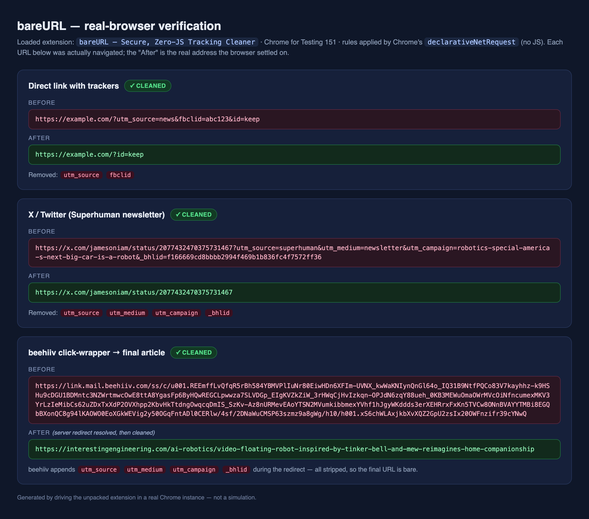
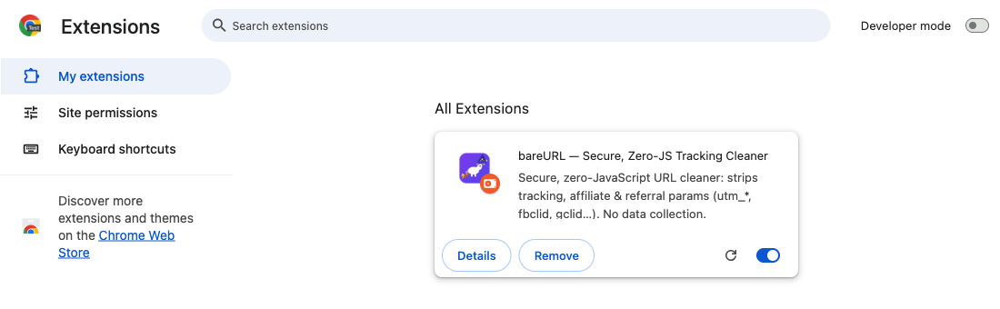

# bareURL

A minimal, **zero-JavaScript** Chrome extension that automatically strips tracking,
affiliate and referral query parameters (`utm_*`, `fbclid`, `gclid`, `mc_eid`,
`msclkid`, `tag`, `ref`, …) from links you open — mainly the ones you click in email.

It's a small, fully auditable alternative to [ClearURLs](https://github.com/ClearURLs/Addon),
which no longer works on Chrome (it relied on Manifest V2's blocking `webRequest`
API, removed in the MV3 migration).

## See it work

Real links, cleaned by the extension running in a **real browser** — not a
simulation. The "after" is the address Chrome actually settled on:

| Before | After |
|--------|-------|
| `https://x.com/jamesoniam/status/2077432470375731467?utm_source=superhuman&utm_medium=newsletter&utm_campaign=…&_bhlid=f166669…` | `https://x.com/jamesoniam/status/2077432470375731467` |
| `https://example.com/?utm_source=news&fbclid=abc123&id=keep` | `https://example.com/?id=keep` |
| `https://link.mail.beehiiv.com/ss/c/u001.REEmff…` *(beehiiv click-wrapper from a newsletter)* | `https://interestingengineering.com/ai-robotics/video-floating-robot-…` |



The extension loaded and enabled — zero-JS, applied by Chrome itself:



> Note on the third row: the beehiiv link is a **server-side click-wrapper** with
> no query params of its own. Following it, beehiiv appends `utm_*` and `_bhlid`
> to the destination — which bareURL then strips, so you land on a bare article
> URL. (These proofs are generated by driving the unpacked extension through
> Chrome for Testing; see [Tests](#tests).)

## Why this instead of a Web Store extension

- **It can't read your browsing.** Under Manifest V3 the rules are applied by
  Chrome itself via `declarativeNetRequest`. There is no content script, no
  `webRequest`, and in fact **no JavaScript at all** at runtime — just two data
  files. There is almost nothing to trust.
- **No supply-chain risk.** It's loaded *unpacked* from this folder. No Chrome
  Web Store account, no silent auto-updates, no "extension sold to a new vendor
  and started injecting affiliate links" (which is exactly how the popular
  open-source option *Linkumori* was compromised).
- **You own the list.** Everything stripped is a plain param name in
  [`rules.json`](rules.json). Read it in one sitting; add or remove at will.

## What's in the box

```
url-param-cleaner/
├── manifest.json          # MV3 manifest — the only permissions are
│                          #   declarativeNetRequest + host access
├── rules.json             # ONE static rule: strip ~130 known params from
│                          #   top-level navigations (main_frame)
├── icons/                 # extension icons (not code)
└── tools/                 # dev-only, NOT loaded by Chrome
    ├── generate-rules.mjs #   regenerates rules.json from ClearURLs' catalog
    └── test-rules.mjs     #   tests that assert rules.json cleans real URLs
```

### About the `<all_urls>` host permission

`redirect` rules require host permissions, so the manifest requests
`host_permissions: ["<all_urls>"]`. Because there is **no content script and no
JavaScript**, this grants *rule application only* — it does **not** let the
extension read page content or network traffic the way `<all_urls>` plus a
content script would. This is the harmless kind of `<all_urls>`.

## Install (once)

1. Clone this repo (or download the ZIP and unzip it):
   ```
   git clone https://github.com/ngnnah/url-param-cleaner.git
   ```
2. Open `chrome://extensions`.
3. Turn on **Developer mode** (top-right).
4. Click **Load unpacked** and select the `url-param-cleaner/` folder.

That's it. No account, no store, no auto-update. Works in any Chromium browser
(Chrome, Edge, Brave, Arc, …).

## Verify it works

1. **It strips trackers:** visit
   `https://example.com/page?utm_source=news&fbclid=abc123&id=keep`
   → the address bar should settle on `https://example.com/page?id=keep`
   (trackers gone, the functional `id` kept).
2. **It's a no-op when clean:** visit `https://example.com/page?id=keep`
   → URL unchanged, page loads normally (confirms no redirect loop).
3. **Real email link:** click a link in a marketing email; after any redirect
   resolves, confirm the final URL has no `utm_*` / `fbclid` / etc.
4. **Rule health:** `chrome://extensions` → this extension → **Errors** should be
   empty (confirms `rules.json` parsed).

> **Still seeing `utm_*` / `_bhlid` after installing or updating the list?**
> Chrome keeps using the old ruleset until the extension is reloaded. Click the
> **⟳ reload** icon on the extension card in `chrome://extensions`, then re-open
> the link. (This was the one gotcha in testing — the rule itself strips these
> correctly, as the proofs above show.)

## Tests

The param catalog is covered by a dev-only test suite that simulates Chrome's
`removeParams` behavior and asserts the resulting URLs (including real
newsletter links). No dependencies — just Node:

```
npm test          # or: node --test tools/test-rules.mjs
```

The tests confirm trackers like `utm_*`, `fbclid`, `gclid` and the newsletter
link-ID `_bhlid` are stripped, functional params (`id`, `q`, `page`, …) are
kept, clean URLs are left untouched, and paths/fragments survive.

## How it works

`rules.json` is a single `declarativeNetRequest` rule that, on top-level
navigations (`main_frame`), redirects the request to the same URL with the known
tracking params removed (`queryTransform.removeParams`). Chrome skips the
redirect when nothing changes, so there are no loops and clean URLs are untouched.

## Maintenance

- **A site broke?** It's almost always one functional param being stripped.
  Remove that name from the `removeParams` array in `rules.json`, then hit the
  reload icon on the extension in `chrome://extensions`. The most likely
  culprits are the affiliate/referral names (`tag`, `ref`, `ref_`, `referrer`,
  the `mk*`/`campid`/`toolid`/`customid` eBay set) — trim freely.
- **Refresh coverage:** re-run `node tools/generate-rules.mjs` to rebuild
  `rules.json` from the latest ClearURLs catalog, then reload the extension.

## Scope (deliberately tiny)

No popup, no options UI, no storage, no analytics, no per-site logic. Params are
stripped globally. This keeps the audit surface to two small data files. Server-side
click-tracker redirects (SendGrid, Mailchimp `list-manage.com`, `google.com/url?q=`)
can't be unwrapped by any MV3 extension — this cleans the **final** URL's params,
which is the real win for email links.
